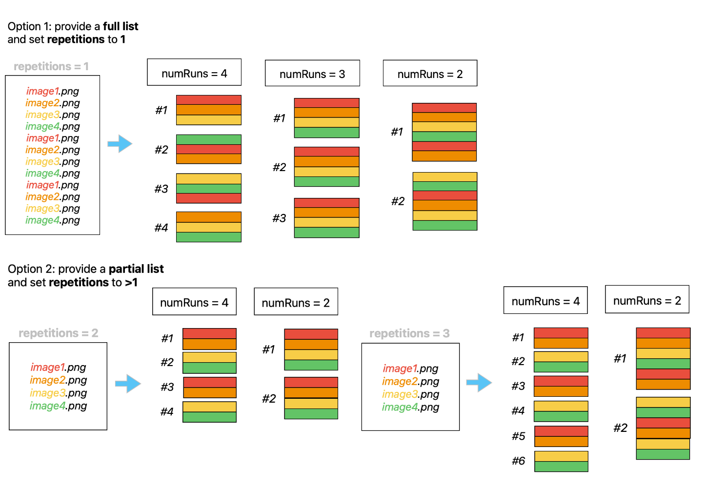
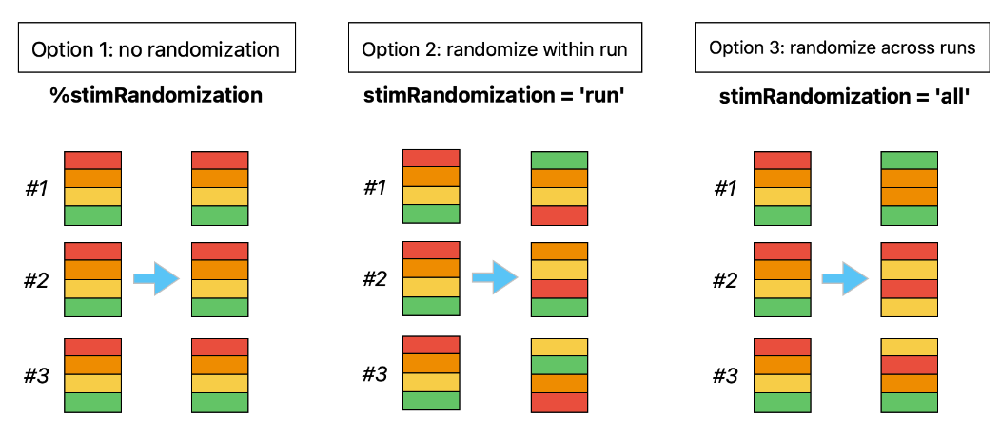
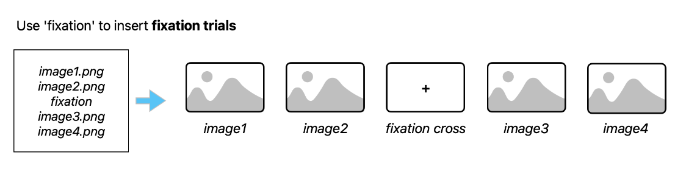

# fMRI-task template

This is a template script for running a task in the fMRI scanner. It is designed to be modular, lightweight and easy to adapt to your needs.

## Requirements

 - `utils`and `src` directories
 - `parameters.txt` file in the `src` directory
 - `list_of_trials.tsv` in the `src` directory

## Parameters

Most of your experiment parameters will be read externally from the `parameters.txt` file. When you conceive your own task, use this document as a checklist for the elements you need to set. Here is a detailled description of all the parameters you will find in `parameters.txt` and what they control.

- `` 
...

## Trial list

This section explains how the trial list is made in the script, along with the randomisation, import of images, etc.

### Here explanations on how to write your `.tsv` trial list

requirements: list of trials in a tsv file, with the first column named 'stimuli' and listing the files

use this if you want to monitor accuracy online: the variable will be read as you add it and can then be used 
in the trial loop

any other column will be read as an extra variable in the trial list structure

### Here, explanations about the randomisation.

### Here explanations about fixation trials

fixation events: explain how writing 'fixation' instead of an image file name will make a fixation trial

## General script design

Here an explanation of what the script does. 
- Mention that it is meant to be played once for each run. 
- Mention that the user has to input the run number each time.
- Mention that the trial list is created once for the current participant, then sampled from for each run.

## 

## Trouble shooting notes

This section lists the most often encountered bugs and their solution

### Screen Setup
If you get an error from the `screen setup` section, it might be a problem with the system frame rate and the frame rate detected by PTB. Perhaps you are using an external monitor? If so, try disconnecting the external monitor, or set `SkipSyncTests` to 1 (ATTENTION: DON`T DO THIS IF YOU ARE RUNNING THE REAL EXPERIMENT! ONLY FOR DEBUG PURPOSES).

### Trigger Wait
There is a known bug currently (as of the 21st of March 2024) where the MRI scanner sends two triggers before beginning. As a result, two keys presses are logged in the trigger wait section, with the start of each run actually taking place after the **second** trigger.
