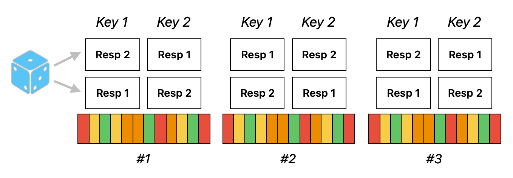
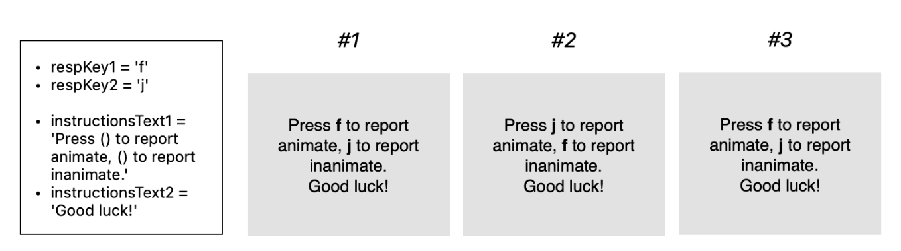

# fMRI task template

This is a template script for running a task in the fMRI scanner. It is designed to be modular, lightweight and easy to adapt to your needs. Your main tool is `fMRI_task.m`, which is designed to play one run of experimental task at a time.

## Requirements

Make sure the following exist in your your root directory:

 - A `utils` folder containing utility functions.
 - A `src` folder containing all your stimuli in `src/stimuli`.
 - A `parameters.txt` file in the `src` directory, containing your experimental parameters.
 - A `list_of_stimuli.tsv` file in the `src` directory, containing a list of your trial stimuli & other relevant variables.

## Parameters

Most of your experiment parameters will be read externally from the `parameters.txt` file. When you conceive your own task, use this document as a checklist for the elements you need to set. Here is a detailled description of all the parameters you will find in `parameters.txt` and what they do.


| Parameter name | Default value | Description |
| :-------------- | :-----------: | :---------- |
| `stimDur`  | `1` | Stimulus presentation time (in seconds). |
| `fixDur`  | `1` | Duration of each post-stimulus fixation (in seconds). |
| `prePost` | `10` | Duration of the pre- and post-run fixation periods (in seconds).|
| `taskName` | *'my_exp'* | Name of your experiment, useful to identify it in output files. |
| `resize` | `true` | Resize flag, determines whether your stimuli get resized or not. |
| `resizeMode` | _'visualUnits'_ | If the resize flag is `true`, determines how to resize the images. Two possible values: _visualUnits_ and _pixelSize_ (see [Trial list](#trial-list)). |
| `outWidth` | `8` | If the resize flag is `true`, the width of your resized stimuli (in pixels or degrees of visual angle, depending on your `resizeMode`. Either one of `outWidth` or `outHeight` has to exist if the `resize` flag is `true`.|
| `outHeight` | `8` | If the resize flag is `true`, the height of your resized stimuli. |
| `numRuns` | `2` | Total number of runs in the experiment. |
| `stimListFile` | *'list_of_stimuli.tsv'* | Name of the file that contains a _partial_ or _full_ list of the experiment trials (see [Trial list](#trial-list)).|
| `numRepetitions` | `2` | How many times to repeat the trials listed in the `stimListFile`. Set to 1 if it contains a full trial list (see [How to write your list of stimuli](#how-to-write-your-list-of-stimuli)). |
| `stimRandomization` | _'run'_ | How to randomize the stimuli in your trial list. Comment out if you don't need any randomisation. Other possible values are 'run' and 'all' (see [Trial randomization](#trial-randomization)). |
| `fixSize` | `.6` | Size of your fixation element (in degrees of visual angle).|
| `fixType` | _'round'_ | Type of fixation element you wish to use (see `displayFixation.m`). Possible values include 'round' and 'cross'.|
| `textSize` | `30` | Size of your text on screen. |
| `textFont` | _'Helvetica'_ | Font of your text on screen. |
| `instructionsText1`, `instructionsText2`, ... | *'On each trial..'* | Line-by-line elements of instruction to give at the beginning of each run. |
| `triggerWaitText` | *'Experiment loading ...'* | Message to display while the script waits for a trigger to begin the task. |
| `scrDistMRI` | `630` | Distance to the screen in the MRI scanner (in mm). |
| `scrWidthMRI` | `340` | Width of the screen in the MRI scanner (in mm). |
| `scrDistPC` | `520` | Estimated distance to the PC screen in debug mode (in mm).  |
| `scrWidthPC` | `510` | Estimated width of the PC screen in debug mode (in mm).|
| `respKeyMRI1`, `respKeyMRI2` | `51`, `52` | Key codes of the response buttons at the scanner (2-button right & red response box).|
| `triggerKeyMRI` | `53` | Key code of the MRI trigger.|
| `respInstMRI1`, `respInstMRI2` | _'left/green'_, _'right/red'_ | Names to display for each key in the instructions at the scanner.|
| `respKeyPC1`, `respKeyPC2` | _'q'_, _'w'_ | Keyboard response keys in debug mode (will also be used in the instructions). |
| `triggerKeyPC` | _'a'_ | Mock trigger keyboard key to use in debug mode.|
| `escapeKey` | _'ESCAPE'_ | Keyboard key to use to abort the experiment.|


## Trial list

The trials of your task will be executed based on the **parameters** and **list of stimuli** file that you input. Upon execution, a list of trials is created that contains all the information about the trials to be played in the experiment. 


### How to write your list of stimuli

Write your list of stimuli in a file called `list_of_stimuli.tsv`, to be placed in the `src` folder. This file should contain _at least_ one column with header name `stimuli`. All other columns are optional, will be read as extra information and stored in the list of trials output file (see below for an example, with two extra variables `animacy` and `setting`).

```
stimuli     animacy     setting
image1.png  animate     outside
image2.png  inanimate   inside
image3.png  inanimate   outside
image4.png  animate     outside
image5.png  animate     inside
```

Your list of trials will be build from the list of stimuli provided in the `stimuli` column of your `list_of_stimuli.tsv` file. Here is how the script will proceed:

1. Based on the length of your stimuli column and the number of repetitions (`numRepetitions`), a total number of trials is calculated (stimuli list length * number of repetitions). The list of stimuli is duplicated to match this length.
2. Based on the number of runs, each entry in the list of stimuli gets assigned a run number, considering evenly long runs and starting from 1.

There are two possible ways of writing this list:

- Provide a **full stimuli list**, with one line for each trial of *the whole* experiment, and set the number of repetitions to 1. This is the way to go if you want to control exactly the whole sequence of action.
- Provide a **partial stimuli list**, with one line for each trial of *one/several run(s)* of the experiment, but not for the whole experiment. In this case, set the number of repetitions to >1. This is the way to go if you are repeating the same set of stimuli several times across the experiment.


The resulting trial list gets enhanced of several extra variables (trial number, etc.) and is then saved as `trial-list-sub#.tsv`. On any given run, the file either already exists and is read, or gets created if it doesn't exist yet.

### Monitoring accuracy

You might wish to monitor the accuracy of your participants online, to have an idea of how the task is going or to give feedback. This can be achieved by playing with extra variables in your `list_of_stimuli.tsv` file. These variables will automatically be indexed in your trial list and can hence be accessed during/right after trial presentation. The script contains a section showing how to use such variables for accuracy monitoring (see the `%% monitoring accuracy` section, l.290).

### Trial randomization

You can ask the script to randomize your trials by playing with the `stimRandomization` parameter.

- Comment out the `stimRandomization` parameter in your parameters file if you don't need any randomization from your list of stimuli.
- Set the `stimRandomization` parameter to _'run'_ to randomize your trials within each run.
- Set the `stimRandomization` parameter to _'all'_ to randomize your trials across all runs.


### Fixation trials

You can introduce fixation events in your task by replacing image file names in your list of stimuli by the word _fixation_. The script will read those differently and show a fixation instead of showing a stimulus for these trials.


### Button randomisation & instructions

This task template takes two response buttons, which can be determined using the `respKey` parameters. A random assignment is made for the first run. The order of buttons is then switched across runs. Make sure the repsonse instructions you write in the `respInst` parameters match the order of the response button parameters. These will be used to render correct instructions at the beginning of each run.



The instructions you write line by line in the parameters will be pasted together in a single paragraph. Add as many instruction lines as you need (`instructionsText4`, `instructionsText5`, ...). Make sure to have two **place holders** in your instructions, denoted with parentheses `()`. These will be replaced by the response instructions you gave, and alternated in between runs.



## Output

Here I describe all the output that users will find in the data folder.
show a tree of the results per participant


## Trouble shooting notes

This section lists the most often encountered bugs and their solution.

| Problem | Resolution |
| :------ | :--------- |
| **Screen Setup** | If you get an error from the `screen setup` section, it might be a problem with the system frame rate and the frame rate detected by PTB. Perhaps you are using an external monitor? If so, try disconnecting the external monitor, or set `SkipSyncTests` to 1 (ATTENTION: DON`T DO THIS IF YOU ARE RUNNING THE REAL EXPERIMENT! ONLY FOR DEBUG PURPOSES). |
| **Trigger Wait** | There is a known bug currently (as of the 21st of March 2024) where the MRI scanner sends two triggers before beginning. As a result, two keys presses are logged in the trigger wait section, with the start of each run actually taking place after the **second** trigger.|
